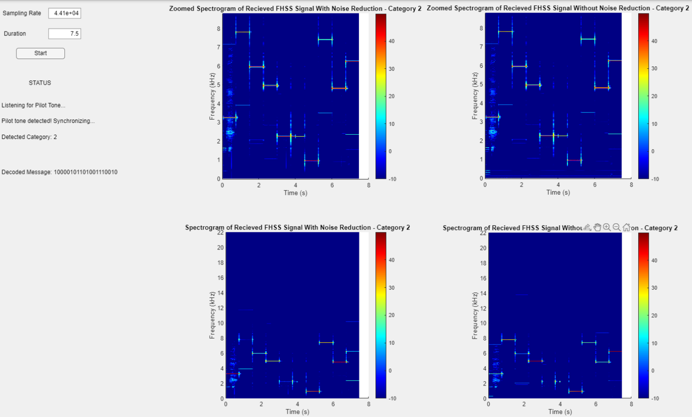

# EE430 Term Project: Frequency-Hopping Spread Spectrum Transmitter and Receiver

## Project Overview
This repository contains the implementation of a Frequency-Hopping Spread Spectrum (FHSS) communication system developed as part of the EE430 Digital Signal Processing course at METU. The project involves creating MATLAB-based transmitter and receiver systems with graphical user interfaces (GUIs). These systems enable the generation, transmission, reception, and decoding of FHSS signals, meeting the requirements outlined in the course project description.

---

## Features
1. **FHSS Transmitter and Receiver**:
   - Implements 2-FSK, 4-FSK, and 8-FSK modulation schemes.
   - Supports three communication categories with distinct parameters (hop period, frequency separation, etc.).

2. **Noise Reduction**:
   - Uses bandpass Butterworth filters and cross-correlation techniques to mitigate noise.

3. **Graphical User Interface (GUI)**:
   - User-friendly GUIs designed using MATLAB's App Designer for both the transmitter and receiver.

4. **Spectrogram Analysis**:
   - Includes time-frequency representation of signals using Short-Time Fourier Transform (STFT).

5. **Category Support**:
   - Fully functional transmitter and receiver for all three categories:
     - **Category 1:** Basic 2-FSK communication.
     - **Category 2:** Intermediate 4-FSK communication.
     - **Category 3:** Advanced 8-FSK communication.

---

## Repository Structure
```plaintext
.
├── transmitter.m         # MATLAB script for transmitter functionality
├── transmitter.mlapp     # MATLAB GUI for transmitter
├── receiver.m            # MATLAB script for receiver functionality
├── receiver.mlapp        # MATLAB GUI for receiver
├── README.md             # Project documentation
└── figures/              # Placeholder for figures used in README and documentation
```

---

## How to Run the Project

### Transmitter Setup
1. Open the `transmitter.mlapp` file in MATLAB's App Designer.
2. Enter a text message and configure signal parameters such as:
   - Modulation order (M-FSK)
   - Hop period (Th)
   - Frequency separation (∆f)
3. Generate the FHSS signal and visualize its spectrogram.
4. Play the generated signal through your PC speakers for transmission.

### Receiver Setup
1. Open the `receiver.mlapp` file in MATLAB's App Designer.
2. Configure recording parameters such as sampling rate and duration.
3. Record the transmitted signal.
4. Visualize the spectrogram of the received signal (both before and after noise reduction).
5. Decode the received signal to retrieve the transmitted text message.

---

## FHSS Communication Details

### Frequency-Hopping Spread Spectrum (FHSS)
FHSS is a method that spreads a signal over a wide bandwidth by rapidly changing its carrier frequency. Key advantages include:
- Resistance to narrowband interference.
- Difficulty of interception and jamming.
- Minimal mutual interference with conventional transmissions.

### Modulation Schemes
The project supports three modulation schemes:
- **2-FSK:** Maps each bit to one of two frequencies.
- **4-FSK:** Maps two bits to one of four frequencies.
- **8-FSK:** Maps three bits to one of eight frequencies.

### Communication Categories
The system is designed to support three categories with different signal parameters:

| Category | Hop Period (s) | Modulation | Frequency Separation (Hz) | Bandwidth (Hz) | Min Data Length |
|----------|----------------|------------|----------------------------|----------------|-----------------|
| 1        | 1.0            | 2-FSK      | 100                        | 4000           | 5               |
| 2        | 0.75           | 4-FSK      | 150                        | 7000           | 20              |
| 3        | 0.50           | 8-FSK      | 200                        | 10000          | 30              |

### Noise Reduction Techniques
- **Bandpass Butterworth Filters:** Remove out-of-band noise.
- **Cross-Correlation:** Detect pilot tones for synchronization.

### Synchronization
Pilot tones are transmitted before the actual signal to synchronize the transmitter and receiver. The receiver uses these tones to align its internal clock with the transmitted signal.

---

## Example Demonstrations

### Transmitter Output
- **Category 1 Example:**
  - Message: `101101`
  - Spectrogram:

    

### Receiver Output
- **Category 1 Example:**
  - Decoded Message: `101101`
  - Spectrograms:


    - With Noise Reduction:
      

---

## Project Demonstrations
During the project demonstration, you are expected to:
1. Show the functionality of both GUIs for all categories.
2. Provide examples of signal generation, transmission, reception, and decoding.
3. Demonstrate synchronization and noise reduction methods.

---

## Contributing
Contributions are welcome! If you have suggestions or improvements, feel free to open an issue or submit a pull request.

---

## License
This project is for educational purposes only and is not licensed for commercial use.

